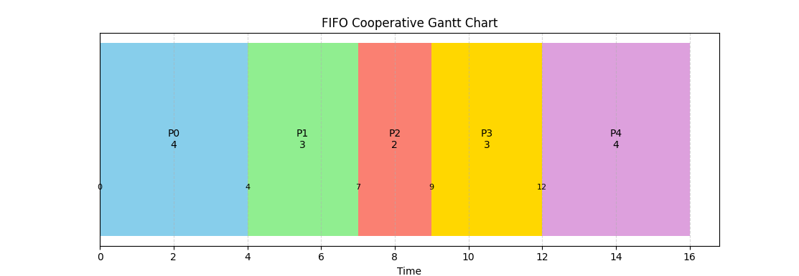

# Gantt Graph Process Algorithm App  

A Python application for visualizing process scheduling algorithms using Gantt charts. This educational tool helps demonstrate various CPU scheduling mechanisms through interactive visualization.

## Table of Contents
- [Introduction](#introduction)
- [Installation](#installation)
- [Features](#features)
- [Usage](#usage)
- [Contributing](#contributing)
- [License](#license)
- [Contact](#contact)
- [Acknowledgments](#acknowledgments)

## Introduction

This application provides visual representations of common process scheduling algorithms through Gantt charts, making it easier to understand how different scheduling mechanisms work. It was developed by Mouad as an educational project to demonstrate process scheduling concepts.

## Installation  

1. Prerequisites
    - Python 3.0 or later
    - matplotlib library

2. Install required dependencies:
    ```bash
        pip install matplotlib
    ```

3. Navigate to the __main__ file and run:
    ```bash
        python __main__.py
    ```

## Features

- Multiple scheduling algorithm implementations:
    * **First In First Out _(FIFO)_**
    * **Round Robin _(RR)_**
    * **Shortest Remaining Time First _(SRTF)_** (Currently under development)
    * **Cooperative Scheduling**
    * **Preemptive Scheduling**

- Flexible data input options:
    * Interactive console input
    * CSV file import
    * Built-in test datasets

- Real-time Gantt chart visualization using matplotlib

## Usage

1. Launch the application using:
    ```bash
        python __main__.py
    ```

2. Choose your data input method:
    - `console`: Manually enter process details
    - `ready`: Import from CSV file
    - `test`: Use built-in test data

3. If using console input, you'll be prompted to enter:
    - Process arrival times
    - Burst times `CPUs`
    - Priority values (if applicable)

4. Select your desired scheduling algorithm

5. View the generated Gantt chart visualization
> ### _Example Gantt Chart:_
> 

## Contributing
We welcome contributions! To contribute:

1. Fork the repository
2. Create a feature branch (`git checkout -b AmazingFeature`)
3. Commit your changes (`git commit -m 'Add some AmazingFeature'`)
4. Push to the branch (`git push origin AmazingFeature`)
5. Open a Pull Request

## License
This project is licensed under the MIT License. See [LICENSE](LICENSE) for more details.

## Contact
For any questions or feedback, contact [Mouad](mailto:moadallaoui1@gmail.com).

## Acknowledgments
Special thanks to:
- [Python](https://www.python.org/) community
- [W3Schools Python Tutorials](https://www.w3schools.com/python/)
- AI assistance from:
    - [OpenAI](https://openai.com)
    - [Blackbox AI](https://www.blackbox.ai)
    - [Anthropic Claude](https://www.anthropic.com)
